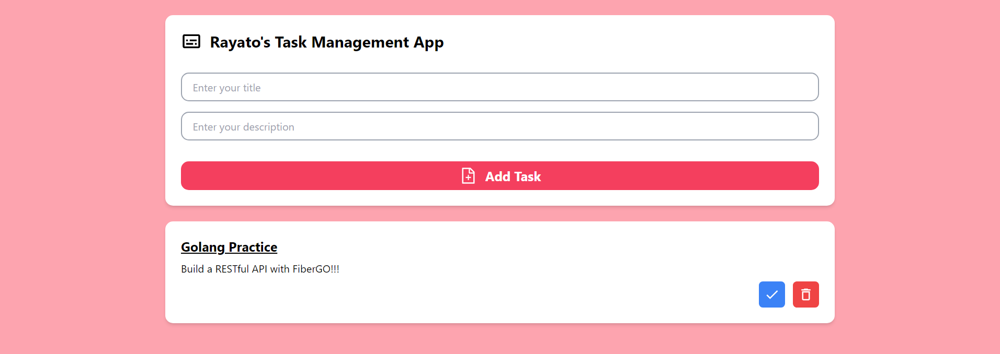

<h1>📑Rayato's Tasks Management App</h1>

This is just a mini project for frontend that was done by React-TS

<h2>Screenshot</h2>

<h2>Function Lists</h2>
<ul>
    <li>Add Task</li>
    <li>Delete Task</li>
    <li>Mask Task</li>
</ul>

<h2>Project URL</h2>

You can test here: <a href="https://rayato159.github.io/Task-Management-React-TS/">Click Me!</a>

